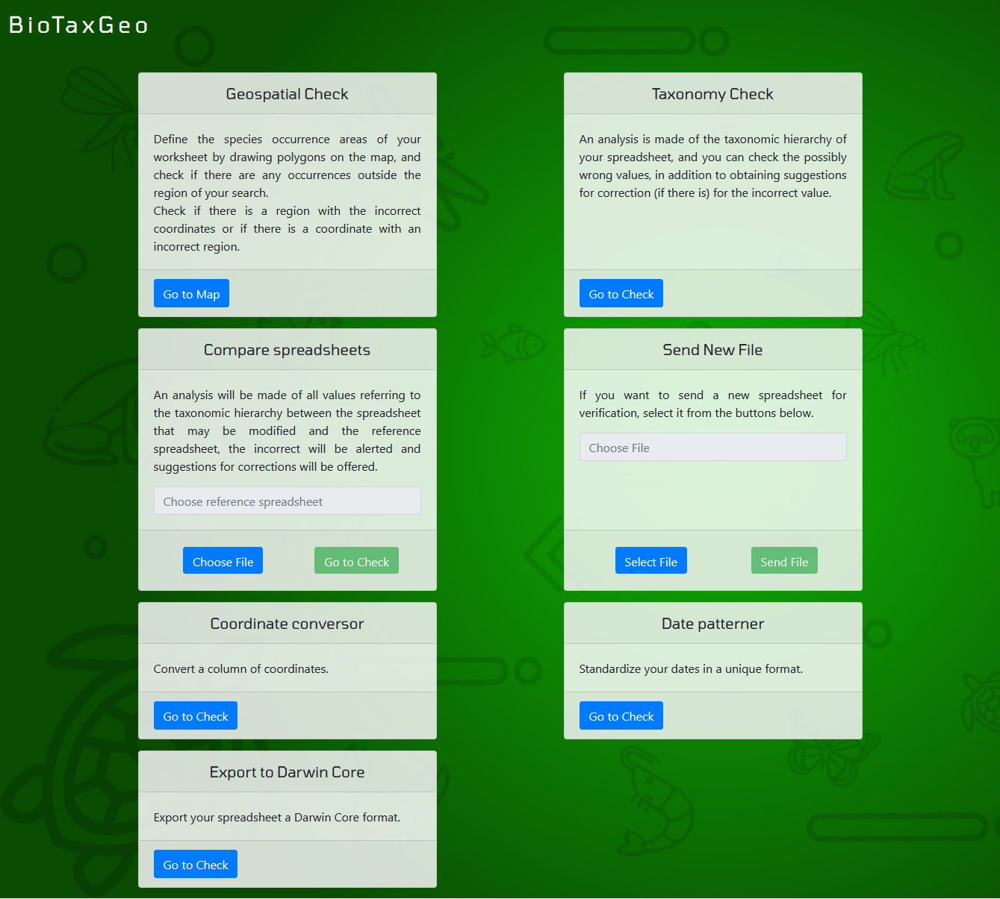

# BioTaxGeo

BioTaxGeo is a quality software for taxonomic, geospatial data and occurrences of biodiversity species, which aims to help biologists and other researchers to identify and correct errors in field collection spreadsheets.

## Sumary
  - [Functionalities](#functionalities)
    - [Database Validation](#database-validation)
    - [Geographical Validation](#geographical-validation)
    - [Comparison between Spreadsheets](#comparison-between-spreadsheets)
   - [Authors](#authors)
   - [License](#license)

## Functionalities

- Database Validadion
- Geographical Validation
- Comparison between Spreadsheets

### Database Validation

To have your data checked by a global system of information about biodiversity ( <a href="https://www.gbif.org/" target="_blank">GBIF</a> ), start the verification by selecting the correct card.

> In this section, will be asked for you to fill the fields correctly to identify the columns in your spreadsheet file.

> Then your spreadsheet will be available, now you can check the suggestions and save the changes if you like

### Geographical Validation

To validate your data for `latitude` and `longitude`, this section lets you check if you typed the right coordinates by showing in the map every entry.

> The first step is to select the correct card.

> Select the corresponding columns in your spreadsheet file.

> Then you will be redirected to plot markers and identify the area you collected the data.

> After saving your coordinates, the map will show which entries have the correct `latitude` and `longitude` according to your spreadsheet file and the polygon you drew.

> Together with a list containing suggestions for possible incorrect entries.

> Validations will be availible at this point for modify the data in your spreadsheet file and save changes if you like.

### Comparison between Spreadsheets

This section will ask for you to fill the fields correctly to identify the columns for `two` spreadsheet files.

> Insert the file that will be used as reference.

> Identify the columns in both files.

> After the software identify your columns, the data will be compared the entries between them.

### Authors

- Marcos Paulo Alves de Sousa
  - email: marcosp.belem@gmail.com
  - github: <a href="https://github.com/marcosp-sousa" target="_blank">marcosp-sousa</a>
- Elielson Fernando dos Santos Barbosa
  - email: elielsonbr.com@gmail.com
  - github: <a href="https://github.com/Elielson68" target="_blank">Elielson68</a>
- Renan Figueiredo Carneiro
  - email: renanfigcarneiro@gmail.com
  - github: <a href="https://github.com/rnanc" target="_blank">rnanc</a>

### License

- MIT License. See [LICENSE](https://github.com/marcosp-sousa/BioTaxGeo/blob/master/LICENSE) for more information
